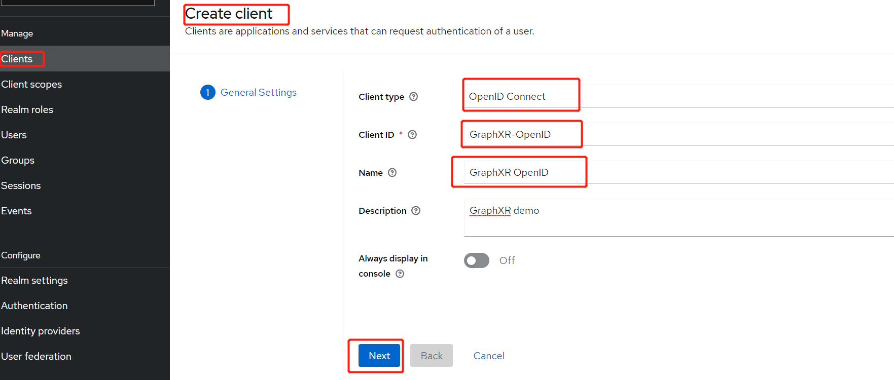
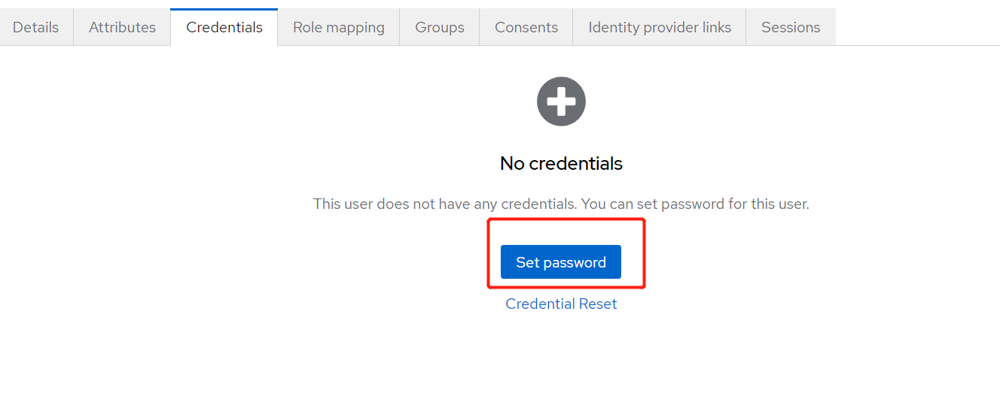
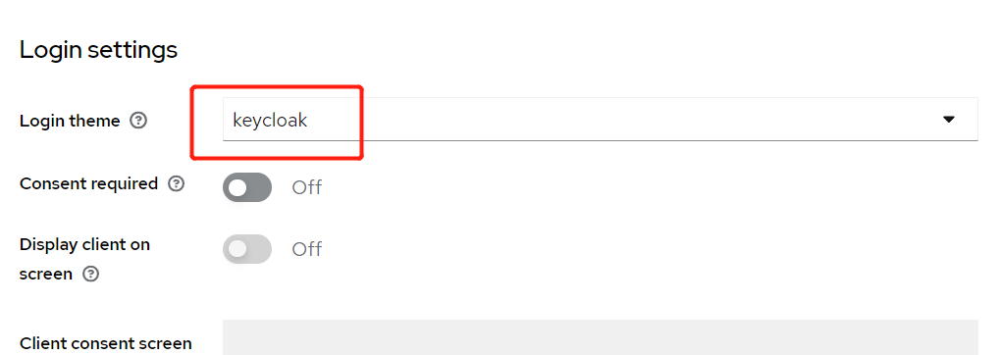
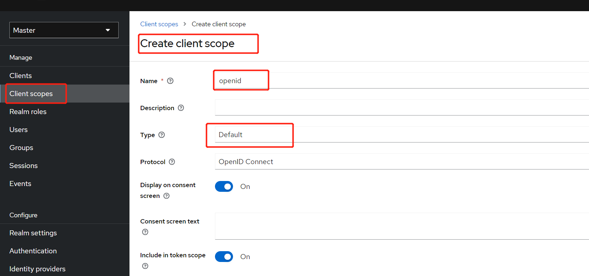
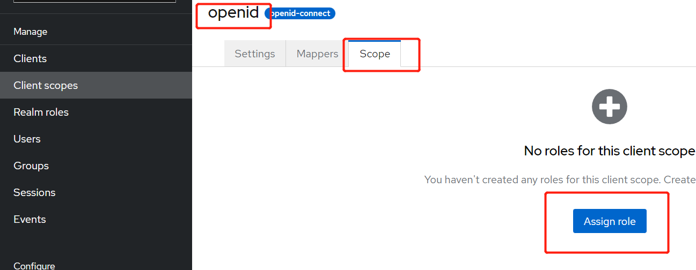
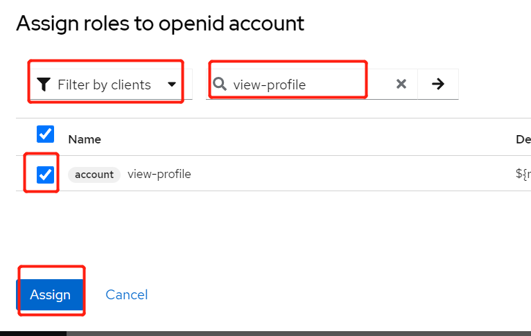
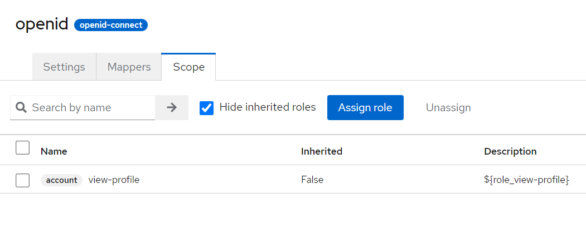
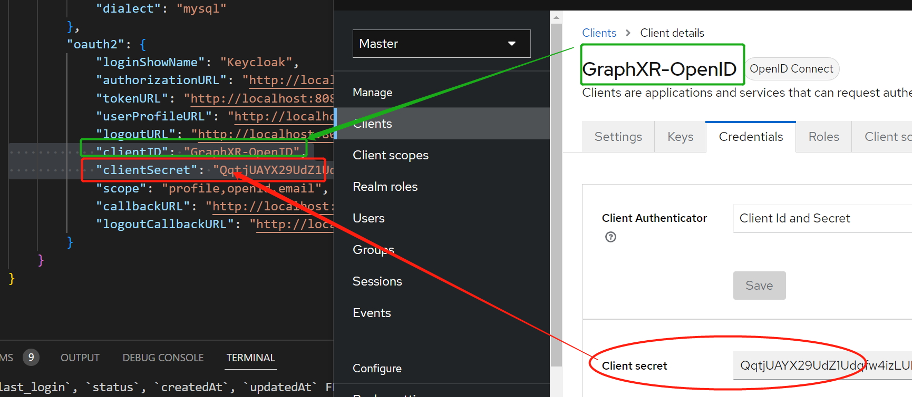

## 1. keycloak:19.0.3 

### 1.1 Run keycloak with docker 

```
bash ./run.sh
```

> default user/pass is admin/admin

### 1.1 Create User  

<http://localhost:8080/admin/master/console/#/master/users>

demo@kineviz.com YourPassword  

#### 1.1.1 Create User


#### 1.1.2 Set Password


### 1.2 Add Client for Oauth2  
#### 1.2.1 Create OpenID Client  
goto http://localhost:8080/admin/master/console/#/master/clients/add-client

```
 Client Type  : OpenID Connect
 Client ID : GraphXR-OpenID
 Name: GraphXR OpenID
 Description: OpenID Demo
```


#### 1.2.2 Capability config


#### 1.2.3 Access settings  

```
Root URL: http://localhost:5000
Home URL: http://localhost:5000/oauth2/login
Valid redirect URLs: http://localhost:5000/*
Valid post logout redirect URIs:  http://localhost:5000/oauth2/logout
Web origins:  
http://localhost:5000   
https://localhost:9000   
```


#### 1.2.4 Login settings  

```
Login theme: keycloak
```



### 1.3 Add openid to Scope

#### 1.3.1 create openid scope


#### 1.3.2 assign role to scope


#### 1.3.2 assign view-profile to scope





## 2. Config the graphxr-embed-auth-example

Copy ./app/config/config.example.json to ./app/config/config.json 



Other info refer http://localhost:8080/realms/master/.well-known/openid-configuration 


## 2. GraphXR config

### 2.1. GraphXR Iframe embed auth config.js

Add the follow iframeAuth info to graphXR config.js

> userProfileURL refer  http://localhost:8080/realms/master/.well-known/openid-configuration 

```
	iframeAuth: {
		keyName: "token",
	  userProfileURL: "http://localhost:8080/realms/master/protocol/openid-connect/userinfo",
	},
```


The GraphXR（http://localhost:9000） iframe embed example link

> The token is requirement, the email is optional if the API(userProfileURL) can response the email info.

```

<iframe src="http://localhost:9000/projects?token={{OpenID_AccessToken}}" width="100%" height="500px"></iframe>

```